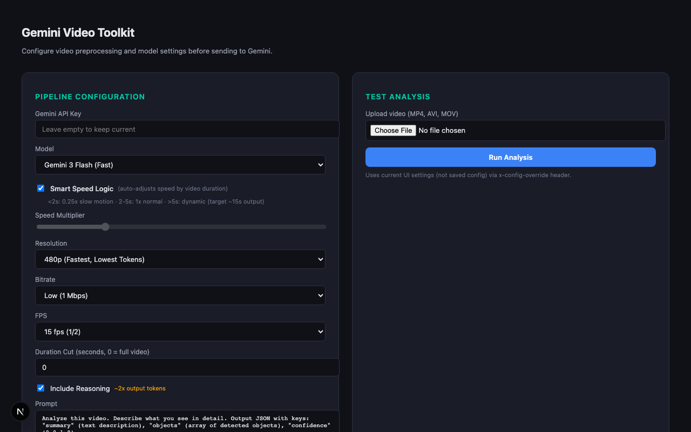

# Gemini Video Toolkit

Video preprocessing pipeline + Gemini vision model integration. Upload a video, tune processing parameters (resolution, speed, FPS, bitrate), and send it to any Gemini model for analysis.

Built for experimenting with how video quality, speed, and frame rate affect Gemini's analysis quality and token usage.



## What it does

1. **Video preprocessing** — FFmpeg pipeline with configurable resolution, speed, FPS, bitrate, and duration cutting
2. **Smart Speed Logic** — automatically adjusts playback speed based on video duration (slow motion for micro clips, dynamic speedup for long videos)
3. **Model switching** — switch between Gemini Flash, Pro, or any model variant without code changes
4. **Custom prompts** — change what you're asking Gemini to analyze
5. **Admin dashboard** — web UI to tune all parameters and test videos in real-time
6. **Config override** — test different settings per-request via header without saving

## Quick start

```bash
# Prerequisites: Node.js 20+, FFmpeg installed
npm install
npm run dev
```

Open `http://localhost:3000` — set your Gemini API key and start testing.

## API

### POST /api/analyze

Upload a video file for processing and analysis.

```bash
curl -X POST http://localhost:3000/api/analyze \
  -F "file=@video.mp4"
```

Response:
```json
{
  "success": true,
  "processing": {
    "model": "gemini-3-flash-preview",
    "speedUsed": 4.0,
    "originalDuration": 60.0,
    "resolution": "480p",
    "fps": 15,
    "bitrate": "Low",
    "smartSpeed": true
  },
  "analysis": {
    "summary": "...",
    "objects": ["..."],
    "confidence": 0.95
  },
  "tokens": { "input": 1234, "output": 200 },
  "timeMs": 3500
}
```

Override settings per-request:
```bash
curl -X POST http://localhost:3000/api/analyze \
  -H 'x-config-override: {"model":"gemini-3-pro-preview","targetResolution":"720p"}' \
  -F "file=@video.mp4"
```

### GET/POST /api/config

Read or update the pipeline configuration.

## Video processing parameters

| Parameter | Options | Default | Effect |
|-----------|---------|---------|--------|
| `targetResolution` | 1080p, 720p, 480p | 480p | Lower = fewer tokens, faster |
| `targetBitrate` | High (5M), Medium (2.5M), Low (1M) | Low | Lower = smaller file, less detail |
| `targetFps` | 30, 15, 7.5 | 15 | Lower = fewer frames for Gemini to process |
| `speedMultiplier` | 1-40x | 10 | Speeds up video (or use Smart Speed) |
| `useSmartSpeed` | true/false | true | Auto-adjusts speed by duration |
| `cutDurationSeconds` | 0+ | 0 | Cuts first N seconds (0 = full video) |
| `includeReasoning` | true/false | true | Adds explanation (~2x output tokens) |
| `prompt` | any string | generic | What to ask Gemini about the video |

### Smart Speed Logic

When enabled, speed is automatically adjusted based on input video duration:

- **< 2 seconds**: 0.25x slow motion (gives the model more temporal context)
- **2-5 seconds**: 1x normal speed
- **> 5 seconds**: dynamic speed targeting ~15s output (e.g., 60s video → 4x speed)

## Tech stack

- **Next.js** — API routes + React dashboard
- **FFmpeg** — video preprocessing (scale, speed, fps, bitrate, cut)
- **Google Generative AI SDK** — Gemini model integration
- **TypeScript** — throughout

## Requirements

- Node.js 20+
- FFmpeg installed and in PATH
- Gemini API key ([ai.google.dev](https://ai.google.dev/))
